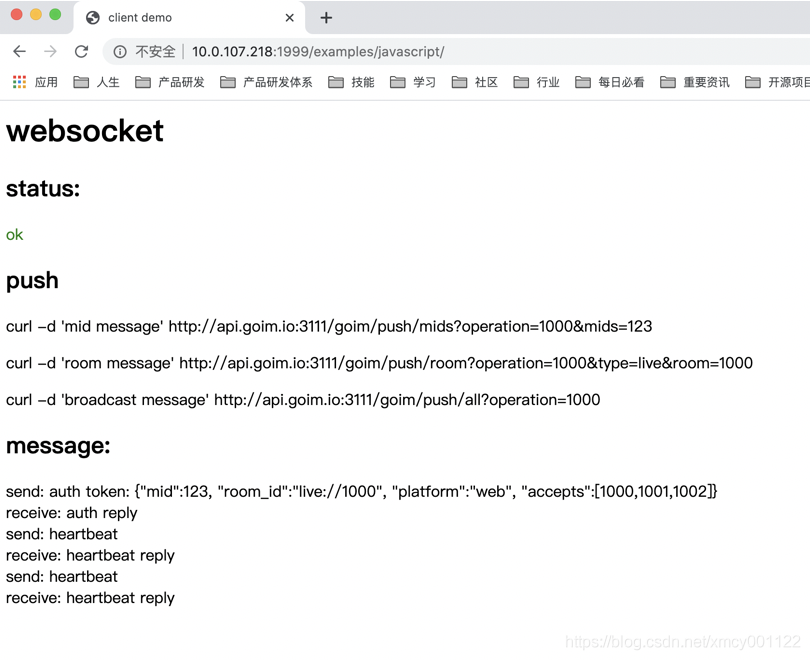

goim教程
==============

官网：https://goim.io/
goim是bilibili公司技术总监毛剑创作，使用go语言开发，用于B站生产线上的IM服务框架（聊天室），其框架原理图如下：

## 特性
 * 轻量级
 * 高性能
 * 纯Golang实现
 * 支持单个、多个、单房间以及广播消息推送
 * 支持单个Key多个订阅者（可限制订阅者最大人数）
 * 心跳支持（应用心跳和tcp、keepalive）
 * 支持安全验证（未授权用户不能订阅）
 * 多协议支持（websocket，tcp）
 * 可拓扑的架构（job、logic模块可动态无限扩展）
 * 基于Kafka做异步消息推送
 
## Architecture


## Quick Start

```bash
make build
make up
```

### Dependencies

- [Discovery](https://github.com/bilibili/discovery)
- Kafka
- Redis


## 基础环境

golang环境
1.下载二进制包：go1.5.2linux-amd64.tar.gz

```bash
wget https://dl.google.com/go/go1.15.2.linux-amd64.tar.gz
```
2.将下载的二进制包解压至 /usr/local目录

```bash
tar -C /usr/local -xzf go1.14.3.linux-amd64.tar.gz
```
3.配置go环境变量
```bash
$ vim ~/.bash_profile
# 将以下环境变量添加到profile最后面
export GOROOT=/usr/local/go
export PATH=$PATH:$GOROOT/bin
export GOPATH=/home/go              // 存放go源码的目录
$ source ~/.bash_profile // 生效
$ go env // 查看是否成功
```
## java

1.下载：https://www.oracle.com/java/technologies/javase/javase8u211-later-archive-downloads.html
```bash
$ mkdir -p /usr/local/java
$ tar -zxvf jdk-8u241-linux-x64.tar.gz -C /usr/local/java/ # 解压
```
2.环境变量配置
```bash
$vim ~/.bash_profile

# 加入到末尾
export JAVA_HOME=/usr/local/java/jdk1.8.0_141
export JRE_HOME=${JAVA_HOME}/jre
export CLASSPATH=.:${JAVA_HOME}/lib:${JRE_HOME}/lib
export PATH=${JAVA_HOME}/bin:$PATH

$ source ~/.bash_profile
$ java -verison

```

## kafka
具体见：http://kafka.apache.org/quickstart

1.下载安装
```bash
cd /data
wget https://mirror.bit.edu.cn/apache/kafka/2.5.0/kafka_2.12-2.5.0.tgz
tar -zxvf kafka_2.12-2.5.0.tgz
cd kafka_2.12-2.5.0
```

2.启动ZooKeeper
```bash
bin/zookeeper-server-start.sh config/zookeeper.properties
```
3.启动kafka
```bash
bin/kafka-server-start.sh config/server.properties
```
4.后台启动
上面2和3执行后，终端退出服务就停止了，加&变成后台运行，使用nohup把输出重定向到另外一个文件
```bash
nohup sh bin/zookeeper-server-start.sh config/zookeeper.properties >>zookeeper.out &
nohup sh bin/kafka-server-start.sh config/server.properties >>kafka.out &
```
restart_kafka.sh如下
```bash
#!/bin/sh
# 停止
stop(){
  ./kafka-server-stop.sh
}

# 启动
start(){
  nohup sh bin/kafka-server-start.sh config/server.properties >>kafka.out &
}

stop
start
```
5.测试，创建一个topic
```bash
bin/kafka-topics.sh --create --bootstrap-server localhost:9092 --replication-factor 1 --partitions 1 --topic test
```
6.查看已创建的topic
```bash
bin/kafka-topics.sh --list --bootstrap-server localhost:9092
```
上面都OK，恭喜你，单机版的kafka安装启动成功！

针对goim需要的一些配置：
1.创建goim-push-topic（job会用到）
```bash
bin/kafka-topics.sh --create --bootstrap-server localhost:9092 --replication-factor 1 --partitions 1 --topic goim-push-topic
```
2.更改监听IP地址
```bash
vim config/server.properties
# 把下面一行取消注释，并且输入部署kafka机器的IP地址
#listeners=PLAINTEXT://:9092
listeners=PLAINTEXT://10.0.107.218:9092
```
## redis
1.安装启动
```bash
yum install redis
systemctl restart redis # 启动redis
```
2.更改配置文件
```bash
vim /etc/redis.conf
bind 127.0.0.1 -> bind 10.0.107.218
systemctl restart redis # 启动redis
```
3.可选【安装mac redis可视化工具 rdm】
点击connect to redis server，输入host。然后点击Test Connection，提示成功后点击OK即可。

## 编译goim
参考：https://goim.io/tutorials/
```bash
cd $GOPATH/src  // 上面的/home/go，也可以使用echo $GOPATH查看具体路径
mkdir -p github.com/Terry-Mao/
cd github.com/Terry-Mao/
git clone https://github.com/Terry-Mao/goim.git
cd goim

make build
```
成功后，生成target目录，包含下面的文件：

```bash
PS：他们都依赖7171端口的discovery服务，这个是出自bilibili的一个类似zookeeper的服务注册与发现的模块，见下面。
```
## 编译Discovery

具体见：https://github.com/bilibili/discovery

PS1：go1.12以上版本
PS2：该开源项目参考了spring cloud里面服务发现的Netflix Eureka（https://github.com/Netflix/eureka）模块设计。
PS3：本质上也是认为ZK难用好，复杂而自研的服务注册与发现框架。
```bash
cd $GOPATH/src
git clone https://github.com/bilibili/discovery.git
cd discovery/cmd/discovery
go build

cp discovery 
```

编译goim的websocket-server，这是自带测试的客户端，使用了gin框架

```bash
cd $GOPATH/src/github.com/Terry-Mao/goim/examples/javascript
go build -o httpd-ws
```

## 安装
新增data目录
```bash
cd /
mkdir -p /data/goim
```
2.拷贝goim（包括comet、logic、job和3个配置文件）
```bash
cp -r $GOPATH/src/github.com/Terry-Mao/goim/target /data/goim/
```
3.拷贝goim-websocket的example服务端
```bash
cp -rf $GOPATH/src/github.com/Terry-Mao/goim/examples /data/goim/
```
4.拷贝discovery
```bash
cp $GOPATH/src/discovery/cmd/discovery/discovery /data/goim/target/
cp $GOPATH/src/discovery/cmd/discovery/discovery-example.toml /data/goim/target/
cd /data/goim/
ls 
```
现在/data/goim应该是这样的
```bash
[root@localhost goim]# ls
examples  target
[root@localhost goim]# ls target/
comet  comet.toml  discovery  discovery.toml  job  job.toml  logic  logic.toml
[root@localhost goim]# ls examples/
cert.pem  javascript  private.pem
```
下面简述一下如何修改配置文件，和增加restart.sh和stop.sh，一键启动和停止。

## 部署

假设本机IP为：10.0.107.218，kafka\redis\discovery\goim\examples都部署在1台机器上。

1.kafka检查IP并重启
```bash
vim /data/kafka_2.12-2.5.0/config/server.properties
listeners=PLAINTEXT://10.0.107.218:9092
```
2.redis检查IP
```bash
vim /etc/redis.conf
bind 10.0.107.218
```
3.关闭防火墙
```bash
systemctl stop firewalld # 注意如果重启防火墙会自动打开，可以永久禁用掉systemctl disable firewalld
```
4.discovery-example.toml（注意，不能改成discovery.toml，否则会出错）
```bash
cd /data/goim/target && vim discovery-example.toml
nodes = ["10.0.107.218:7171"]
addr = "10.0.107.218:7171"
```
5.comet.toml
```bash
vim comet.toml
nodes = ["10.0.107.218:7171"] # discovery的地址
certFile = "examples/cert.pem" # wss协议ssl证书
privateFile = "examples/private.pem" # ssl私钥
WhiteLog  = "log/white_list.log" # 统一存放到/data/goim/log目录下
```
PS：example里面的websocket客户端就是连接的logic的3102端口。

6.job.toml
```bash
vim job.toml
: # 输入一个:号，进入替换模式
%s/127.0.0.1/10.0.107.218/g
```
7.logic.toml
```bash
vim logic.toml
: # 输入一个:号，进入替换模式
%s/127.0.0.1/10.0.107.218/g
```
PS：发消息使用postman测试是的WEB API是logic提供的。

8.examples
```bash
vim /data/goim/examples/javascript/client.js
//var ws = new WebSocket('ws://sh.tony.wiki:3102/sub');
var ws = new WebSocket('ws://10.0.107.218:3102/sub');
```
9.创建log目录
```bash
mkdir -p /data/goim/log
mkdir -p /data/goim/log/comet
mkdir -p /data/goim/log/discovery
mkdir -p /data/goim/log/job
mkdir -p /data/goim/log/logic
cd /data/goim/log && vim white_list.log # 创建一个空文件
```
10.stop.sh
```bash
#!/bin/sh

stop(){
  pkill -f target/logic
  pkill -f target/job
  pkill -f target/comet
  pkill -f target/discovery
}

stop
```
11.restart.sh
```bash
nohup：终端退出时，可以服务运行
&：后台运行，但是如果只有这个命令，终端退出后进程终止。
-> log/discovery.log：把nohub捕获的输出写入到文件中
-log.dir=“log/discovery”：glog库，输出日志文件的目录。不设置则不会有日志
-stderrthreshold=INFO：glog库，输出日志到控制台。
注意：glog是基于性能考虑，每隔一段时间（10秒？）才会刷一次log（写入文件和控制台）
```
```bash
#!/bin/sh
stop(){
  pkill -f target/logic
  pkill -f target/job
  pkill -f target/comet
  pkill -f target/discovery
}

startDiscovery(){
  echo 'start discovery'
  nohup target/discovery -conf=target/discovery-example.toml -log.dir="log/discovery" > log/discovery.log &
}

startHttpWsServer(){
  echo 'start websocket server'
  nohup examples/javascript/httpd-ws > log/httpd-ws.log &
}

startGoim(){
  echo 'start logic server'
  nohup target/logic -conf=target/logic.toml -region=sh -zone=sh001 -deploy.env=dev -weight=10 -log_dir="log/logic" -stderrthreshold=INFO 2>&1 > log/logic.log &
  sleep 1

  echo 'start comet server'
  nohup target/comet -conf=target/comet.toml -region=sh -zone=sh001 -deploy.env=dev -weight=10 -addrs=10.0.107.218 -debug=true -log_dir="log/comet" -stderrthreshold=INFO 2>&1 > log/comet.log &
  sleep 1

  echo 'start job server'
  nohup target/job -conf=target/job.toml -region=sh -zone=sh001 -deploy.env=dev -log_dir="log/job" -stderrthreshold=INFO 2>&1 > log/job.log &
}

show(){
  sleep 1
  ps aux|grep target
}

stop
startDiscovery
startHttpWsServer
sleep 2
startGoim
show
```
## 运行
1.确保kafka和redis已启动。具体见上面
2.启动
```bash
cd /data/goim/ && chmod 777 *.sh
./restart.sh
```
3.查看
```bash
ps aux|grep target
```
4.日志
```bash
tail -f log/comet.log       # 看这个
tail -f log/logic.log       # 和这个多一点
tail -f log/discovery.log
tail -f log/job.log
```
## 测试
1.浏览器访问：http://10.0.107.218:1999/


2.使用postman向聊天室发一条消息


## Examples

- Websocket: [Websocket Client Demo](examples/javascript)

## 文档
[push http协议文档](docs/push.md) 推送接口

## 参考资料

- [goim 中的 data flow 数据流转及思考](https://juejin.im/post/5cd12fa16fb9a0320b40ec32)
- [goim-wiki architecture and Customization](https://github.com/Terry-Mao/goim/wiki/architecture-and-Customization)
- [accept Rooms](https://github.com/Terry-Mao/goim/issues/298)
- [goim v2.0 Roadmap](https://github.com/Terry-Mao/goim/issues/235)
- [请问避免客户端重复登录](https://github.com/Terry-Mao/goim/issues/210)
- [发送消息设计问题](https://github.com/Terry-Mao/goim/issues/185)
